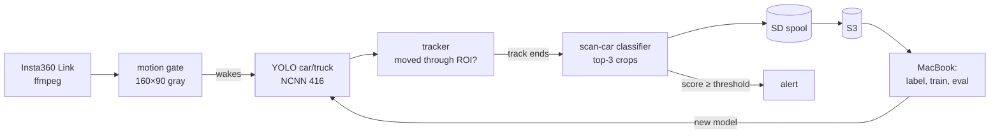

# scanwatch

A Raspberry Pi 5 behind a window that spots Amsterdam's parking-enforcement **scan cars**: ordinary
white cars (Opel Corsa-e, "Parkeercontrole") with a camera pod on the roof, scanning plates as they drive by.


<sub>All images in this repo are anonymized: plate zones and people are blurred, the scan car's plate included.</sub>

## How it works

Two small models, both running on the Pi:

1. **Find the cars.** Stock COCO `yolo11n` (NCNN, 416 px) detects cars and trucks. No training needed.
2. **Is it a scan car?** A tiny `yolo11n-cls` classifier (224 px) looks at crops of each car.
   It only has to learn one thing: *roof pod or not*.


<sub>Left: a scan car. Right: normal traffic. Percentages are the detector's "this is a car" confidence.</sub>

Each car becomes a **track** while it drives through the frame. The classifier scores the 2–3 best,
least occluded crops and the track score is their average, so one bad frame never decides alone.


Crops come from one shared function, [`crop.py`](train/scancar/crop.py), used by both the Pi and
training: 15% padding on all sides plus 15% extra on top, so the roof pod is never clipped.

### Only cars that drive past

Motion detection alone fires on pedestrians, cyclists, shadows and headlights. Here it only *wakes up* the
detector; what gets stored is decided by three filters:

- **Class filter**: only car/truck count. People and bikes are never tracked.
- **ROI**: only the road counts, not the sidewalks or the bike racks.
- **Travel**: a track must move ≥ 15% of the frame width, so the parked Tesla in front of the window
  never becomes an upload, no matter how often someone walks by.


<sub>Yellow: the ROI. Dots: where the wheels of passing cars touched the road (red: scan car, green: other traffic).</sub>



## The loop

The model gets better as the Pi collects data:

1. The **Pi uploads every car** that drives past to S3, sorted by its own verdict
   (`scancar/` or `car/`). The sort threshold is deliberately low: a false positive costs a
   glance, a missed scan car would get buried.
2. On the Mac you **label** the uploads in a local review UI. Every detected car is boxed on its frame;
   click a box and press a key.
3. **Train** the classifier, **evaluate** it per track (recall at ≤ 1 false alarm per day, not top-1
   accuracy), and **deploy** the new model to the Pi.

## Repo layout

```
server/                 runs on the Pi (Python 3.11)
  camserver/            camera, motion gate, detector, tracker, uploader, Discord, web UI
  models/               NCNN detector models (git-ignored, shipped by deploy.sh)
  deploy.sh             deploy from the Mac: sync, install, restart
  .env.example          all settings, copy to .env
  camserver.service     systemd unit (installed by deploy.sh)
train/                  runs on the Mac (Python 3.12, PyTorch MPS)
  scancar/              shared code; crop.py is also used by the Pi
  bootstrap.py          frames -> labelled car crops
  label.py              review UI (http://localhost:8765)
  seed_s3.py            upload the bootstrap data to S3 in the Pi's layout
  config.yaml
docs/                   README images (make_images.py regenerates them)
```

## Deploying the server to the Pi

Everything is deployed from the Mac with one script, [`server/deploy.sh`](server/deploy.sh). It syncs the
code and models, (re)builds the Pi's Python environment when `requirements.txt` changed, installs the
systemd unit and restarts the service. The Pi's `.env`, `.venv` and spool are never overwritten (unless you pass `--env`).

### 1. One-time setup on the Pi

Raspberry Pi 5, Raspberry Pi OS Bookworm (64-bit), the Insta360 Link on USB, WireGuard up.

```bash
sudo apt install -y ffmpeg v4l-utils python3-venv
ip -4 addr show wg0          # note the WireGuard IP: this is BIND below
```

From the Mac, make sure SSH works without a password (the script runs several ssh commands):

```bash
ssh-copy-id pi@<wireguard-ip>
```

The script uses `sudo` for the systemd unit. That works out of the box on Raspberry Pi OS; if your
user needs a password for sudo, the script stops and prints the command to run by hand.

**Replacing the old server?** Only one process can own the camera, so stop it once:
`sudo systemctl disable --now <old-service>` (or kill the `server.py` process).

### 2. Configure on the Mac

All settings live in `server/.env` (template: [`.env.example`](server/.env.example)). Edit them on the
Mac and push them with `--env`, so there is one source of truth.

```bash
cd server
cp .env.example .env         # once
```

| Setting | Set to |
|---|---|
| `BIND` | the Pi's WireGuard IP; the web UI only listens there |
| `S3_*` | endpoint, bucket, region and keys of the bucket |
| `UPLOAD` | `0` for the first run, `1` once tracks look right |
| `DISCORD_WEBHOOK_URL` | optional: channel settings → Integrations → Webhooks |
| `ROI` | road polygon; the default fits the current camera framing |
| `CLS_MODEL` | empty until a scan-car model is trained (the Pi then only collects) |

`.env` holds secrets (S3 keys, webhook URL): it is git-ignored and pushed with mode 600.

The detector models in `server/models/` are git-ignored too. On a fresh clone, export them once:

```bash
uv venv -p 3.11 .venv && uv pip install -p .venv/bin/python -r requirements.txt pnnx
mkdir -p models && cd models
../.venv/bin/yolo export model=yolo11n.pt format=ncnn imgsz=416 && mv yolo11n_ncnn_model yolo11n_416_ncnn_model
../.venv/bin/yolo export model=yolo11n.pt format=ncnn imgsz=640 && mv yolo11n_ncnn_model yolo11n_640_ncnn_model
cd ..
```

### 3. First deploy

```bash
./deploy.sh pi@<wireguard-ip> --env --logs
```

| Flag | |
|---|---|
| `--env` | also push your local `server/.env` (overwrites the Pi's) |
| `--logs` | follow the service log afterwards (Ctrl-C to stop) |
| `PI=pi@<ip>` | set once (`export PI=…`) and just run `./deploy.sh` |
| `PI_DIR=…` | install path on the Pi, relative to home (default `scanwatch/server`) |
| `PI_SERVICE=…` | systemd unit name (default `camserver`) |

The first deploy creates the virtualenv and installs ultralytics/torch: about 10 minutes. After that a
deploy takes seconds.

### 4. Check that it works

With `UPLOAD=0`, nothing leaves the Pi yet. Open from the Mac (over WireGuard):

- `http://<wireguard-ip>:8080`: live view with a status line (motion, live/stored/ignored tracks, upload queue).
- `http://<wireguard-ip>:8080/debug.jpg`: the ROI in yellow and green boxes on cars being tracked.
  Refresh while a car passes.

In the log (`--logs`, or `journalctl -u camserver -f` on the Pi) a passing car looks like:

```
car/093512-204: 18 dets, travel 64%
```

Pedestrians and the parked cars should produce **no** line. Stored tracks are in
`~/scanwatch/spool/car/<date>/` on the Pi; look at an `annotated.jpg` to check the box and the path.

Discord: `ssh pi@<wireguard-ip> 'cd scanwatch/server && .venv/bin/python -m camserver.notify'` posts a test message.

### 5. Go live

Set `UPLOAD=1` in `server/.env` and deploy again:

```bash
./deploy.sh --env
```

The spooled tracks upload within seconds; check them in the bucket under `car/<date>/`.

### Updating

| Changed | Run |
|---|---|
| code or models | `./deploy.sh` |
| settings in `.env` | `./deploy.sh --env` |
| `requirements.txt` | `./deploy.sh` (pip runs automatically) |
| nothing, just restart | `ssh pi@<ip> sudo systemctl restart camserver` |

Rolling back: check out the previous commit on the Mac and run `./deploy.sh` again.

### Troubleshooting

| Symptom | Likely cause |
|---|---|
| `Address already in use` / camera busy | the old server is still running (step 1) |
| `Cannot assign requested address` | `BIND` is not the Pi's WireGuard IP, or wg0 is down |
| no frames, `/snap` returns 503 | camera unplugged or another process owns `/dev/video0` |
| cars pass but no track is stored | car outside the ROI or not moving enough: check `/debug.jpg`, tune `ROI` / `MIN_TRAVEL` |
| parked car stored repeatedly | raise `MIN_TRAVEL` |
| upload queue grows | S3 credentials or network; `/status` shows `last_error` |
| `sudo needs a password` | run the printed command on the Pi, or allow passwordless sudo for your user |

### On the Pi

Models live in `server/models/`: `yolo11n_416_ncnn_model` (detection) and `yolo11n_640_ncnn_model`
(a low-confidence pass that finds every plate and person to blur before a full frame is stored).

| Endpoint | |
|---|---|
| `/` | live view, gimbal control, status |
| `/debug.jpg` | latest frame with the ROI and live tracks drawn in, for tuning |
| `/status` | motion level, live/stored/ignored tracks, upload queue, Discord |
| `/stream`, `/snap`, `/state`, `POST /set` | MJPEG stream, snapshot, gimbal |

**Discord alerts.** With `DISCORD_WEBHOOK_URL` set, the Pi posts every scan car above the alert
threshold, with the annotated frame and a close-up. Both images are cut from the anonymized frame,
never from the raw crops. Alerts within `DISCORD_MIN_GAP` seconds are merged. This needs a trained
classifier (`CLS_MODEL`); until then the Pi only collects.

**Tune without the Pi.** Replay a folder of frames or a video through the full pipeline on the Mac:

```bash
.venv/bin/python -m camserver.replay street.mp4 --det models/yolo11n_416_ncnn_model --spool /tmp/spool
```

## S3 layout

```
scancar/<date>/<track>/   Pi thinks: scan car (P ≥ ROUTE_THRESHOLD)
car/<date>/<track>/       every other moving vehicle
    meta.json             times, path, boxes, scores, model version (uploaded last = track complete)
    000.jpg 001.jpg …     crops, as the classifier sees them
    frame.jpg             one full frame, plates and people blurred
    annotated.jpg         the same frame with the car's box, verdict, path and the ROI, for a quick check
empty/<date>/<HH-MM>.jpg  empty street once an hour (synthetic-data backgrounds, motion tuning)
```

The folder is the Pi's opinion, not a label. Labels are made on the Mac.

## Training (Mac)

```bash
cd train
uv venv -p 3.12 .venv && uv pip install -p .venv/bin/python -r requirements.txt
.venv/bin/python bootstrap.py      # frames in ../datasets/{scancar,othercar} -> data/raw + auto labels
.venv/bin/python label.py          # review: s scancar · o other · h hard negative · k skip
```

Still to come: `pull.py` (S3 → local), `synth.py` (paste the scan car onto empty streets),
`build_dataset.py` (split by event, never by frame), `train.py`, `eval.py` and `export_deploy.py`.

## Privacy (AVG/GDPR)

- Plates are never read, OCR'd or stored as text.
- Full frames are anonymized on the Pi before they are written: plate zones of every vehicle and every
  person are blurred, using a separate low-confidence detection pass so parked cars are covered too.
- Crops are *not* blurred (the classifier has to see the car as it is), so they can contain plates.
  The bucket is private and frames, crops and labels stay out of git (see `.gitignore`).
