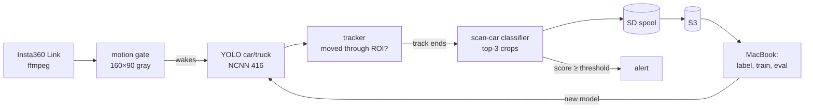

# scanwatch

A Raspberry Pi 5 behind a window that spots Amsterdam's parking-enforcement **scan cars**: ordinary
white cars (Opel Corsa-e, "Parkeercontrole") with a camera pod on the roof, scanning plates as they drive by.


<sub>All images in this repo are anonymized: plate zones and people are blurred, the scan car's plate included.</sub>

## How it works

Two small models, both running on the Pi:

1. **Find the cars.** Stock COCO `yolo11n` (NCNN, 416 px) detects cars and trucks. No training needed.
2. **Is it a scan car?** A tiny `yolo11n-cls` classifier (224 px) looks at crops of each car.
   It only has to learn one thing: *roof pod or not*.


<sub>Left: a scan car. Right: normal traffic. Percentages are the detector's "this is a car" confidence.</sub>

Each car becomes a **track** while it drives through the frame. The classifier scores the 2–3 best,
least occluded crops and the track score is their average, so one bad frame never decides alone.


Crops come from one shared function, [`crop.py`](train/scancar/crop.py), used by both the Pi and
training: 15% padding on all sides plus 15% extra on top, so the roof pod is never clipped.

### Only cars that drive past

Motion detection alone fires on pedestrians, cyclists, shadows and headlights. Here it only *wakes up* the
detector; what gets stored is decided by three filters:

- **Class filter**: only car/truck count. People and bikes are never tracked.
- **ROI**: only the road counts, not the sidewalks or the bike racks.
- **Travel**: a track must move ≥ 15% of the frame width, so the parked Tesla in front of the window
  never becomes an upload, no matter how often someone walks by.


<sub>Yellow: the ROI. Dots: where the wheels of passing cars touched the road (red: scan car, green: other traffic).</sub>



## The loop

The model gets better as the Pi collects data:

1. The **Pi uploads every car** that drives past to S3, sorted by its own verdict
   (`scancar/` or `car/`). The sort threshold is deliberately low: a false positive costs a
   glance, a missed scan car would get buried.
2. On the Mac you **label** the uploads in a local review UI. Every detected car is boxed on its frame;
   click a box and press a key.
3. **Train** the classifier, **evaluate** it per track (recall at ≤ 1 false alarm per day, not top-1
   accuracy), and **deploy** the new model to the Pi.

## Repo layout

```
server/                 runs on the Pi (Python 3.11)
  camserver/            camera, motion gate, detector, tracker, uploader, web UI
  .env.example          all settings, copy to .env
  camserver.service     systemd unit
train/                  runs on the Mac (Python 3.12, PyTorch MPS)
  scancar/              shared code; crop.py is also used by the Pi
  bootstrap.py          frames -> labelled car crops
  label.py              review UI (http://localhost:8765)
  seed_s3.py            upload the bootstrap data to S3 in the Pi's layout
  config.yaml
docs/                   README images (make_images.py regenerates them)
```

## Server (Pi)

```bash
cd server
cp .env.example .env               # BIND = the Pi's WireGuard IP, S3_* credentials, ROI
python3 -m venv .venv && .venv/bin/pip install -r requirements.txt
.venv/bin/python -m camserver      # or: sudo cp camserver.service /etc/systemd/system/ && sudo systemctl enable --now camserver
```

Models go in `~/scanwatch/models/current/`: `yolo11n_ncnn_model` (416 px, detection) and
`yolo11n_640_ncnn_model` (640 px, a low-confidence pass that finds every plate and person to blur
before a full frame is stored). Without a classifier (`CLS_MODEL` empty), the Pi only collects.

| Endpoint | |
|---|---|
| `/` | live view, gimbal control, status |
| `/debug.jpg` | latest frame with the ROI and live tracks drawn in, for tuning |
| `/status` | motion level, live/stored/ignored tracks, upload queue |
| `/stream`, `/snap`, `/state`, `POST /set` | MJPEG stream, snapshot, gimbal |

**Tune without the Pi.** Replay a folder of frames or a video through the full pipeline:

```bash
.venv/bin/python -m camserver.replay street.mp4 --det models/yolo11n.pt --spool /tmp/spool
```

## S3 layout

```
scancar/<date>/<track>/   Pi thinks: scan car (P ≥ ROUTE_THRESHOLD)
car/<date>/<track>/       every other moving vehicle
    meta.json             times, path, boxes, scores, model version (uploaded last = track complete)
    000.jpg 001.jpg …     crops, as the classifier sees them
    frame.jpg             one full frame, plates and people blurred
    annotated.jpg         the same frame with the car's box, verdict, path and the ROI, for a quick check
empty/<date>/<HH-MM>.jpg  empty street once an hour (synthetic-data backgrounds, motion tuning)
```

The folder is the Pi's opinion, not a label. Labels are made on the Mac.

## Training (Mac)

```bash
cd train
uv venv -p 3.12 .venv && uv pip install -p .venv/bin/python -r requirements.txt
.venv/bin/python bootstrap.py      # frames in ../datasets/{scancar,othercar} -> data/raw + auto labels
.venv/bin/python label.py          # review: s scancar · o other · h hard negative · k skip
```

Still to come: `pull.py` (S3 → local), `synth.py` (paste the scan car onto empty streets),
`build_dataset.py` (split by event, never by frame), `train.py`, `eval.py` and `export_deploy.py`.

## Privacy (AVG/GDPR)

- Plates are never read, OCR'd or stored as text.
- Full frames are anonymized on the Pi before they are written: plate zones of every vehicle and every
  person are blurred, using a separate low-confidence detection pass so parked cars are covered too.
- Crops are *not* blurred (the classifier has to see the car as it is), so they can contain plates.
  The bucket is private and frames, crops and labels stay out of git (see `.gitignore`).
