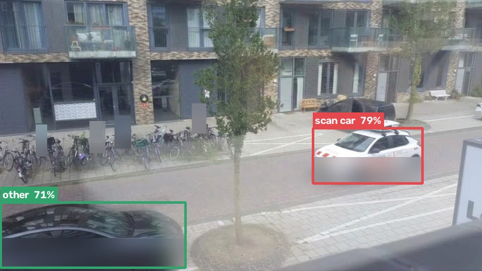
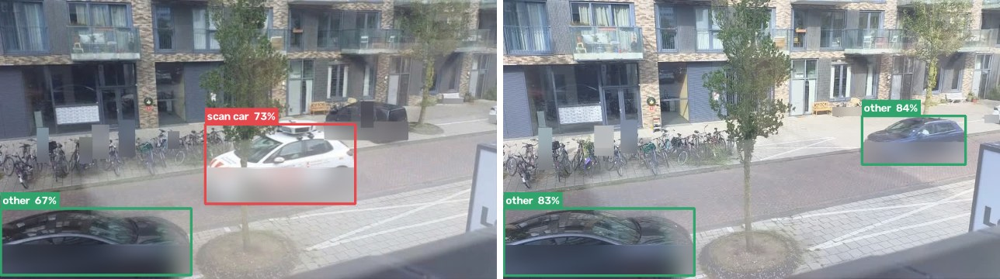
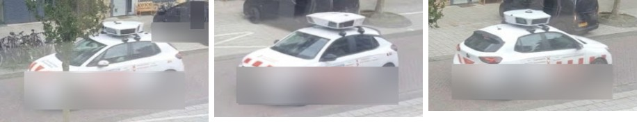
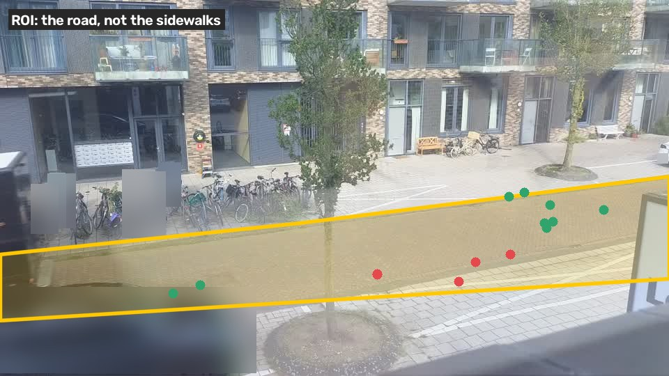
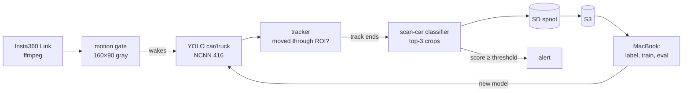

# scanwatch

A Raspberry Pi 5 behind a window that spots Amsterdam's parking-enforcement **scan cars**: ordinary
white cars (Opel Corsa-e, "Parkeercontrole") with a camera pod on the roof, scanning plates as they drive by.



<sub>License plates (the scan car's included) and people are blurred in the images in this README.</sub>

## How it works

Two small models, both running on the Pi:

1. **Find the cars.** Stock COCO `yolo11n` (NCNN, 416 px) detects cars and trucks. No training needed.
2. **Is it a scan car?** A tiny `yolo11n-cls` classifier (224 px) looks at crops of each car.
   There is no hand-written rule: it learns from labelled crops, and a scan car shows two things a
   normal white car doesn't, the **camera pod on the roof** and the **red diagonal stripes** on the
   sides and the back (Gemeente Amsterdam livery). Training keeps both visible: no colour augmentation
   that washes out the red, no random crop that cuts off the roof. Red-on-white vehicles that are
   *not* scan cars (delivery vans, striped trucks) go in as hard negatives, so red alone is not enough.



<sub>Left: a scan car. Right: normal traffic. Percentages are the detector's "this is a car" confidence.</sub>

Each car becomes a **track** while it drives through the frame. The classifier scores the 2–3 best,
least occluded crops and the track score is their average, so one bad frame never decides alone.



Crops come from one shared function, [`crop.py`](server/camserver/crop.py), used by both the Pi and
training: 15% padding on all sides plus 15% extra on top, so the roof pod is never clipped.

### Only cars that drive past

Motion detection alone fires on pedestrians, cyclists, shadows and headlights. Here it only *wakes up* the
detector; what gets stored is decided by these filters, all tuned to drop as little as possible (a false
positive costs a glance, a missed scan car is gone):

- **Class filter**: only car/truck count. People and bikes are never tracked.
- **ROI**: only the road counts, not the sidewalks or the bike racks. The polygon follows the road
  through its bend in the middle of the frame, and a car counts as on the road when the bottom centre of
  its box (where the wheels touch) is inside it. Once a track is on the road it never jumps to a
  detection outside it, so a passing car's track never hops onto the Tesla parked beside the road.
- **Travel**: a track must move ≥ 5% of the frame width (recall first), so the parked Tesla in front of the window
  never becomes an upload, no matter how often someone walks by.
- **No hopping**: once a track is on the road it never continues onto a box whose wheels are off the
  road, and a parked car's track (still for `PARKED_AFTER` s) only continues on a box that clearly
  overlaps it, so a car driving past is never swallowed by a parked one.
- **Short tracks are kept**: a car seen only 1–3 times on the road (very fast, blurred, half hidden) is
  stored even without travel, unless a parked car stands at that spot (`SHORT_TRACK`, 0 = off). This adds
  some duplicate fragments of normal passes; that is the price of not missing the fast ones.
- **Fast cars**: each track is matched where the car *should* be now (its last position moved on at its
  speed), so a car crossing the frame in under a second is still one track instead of many short ones.
- **Stop = done**: a pass that comes to a stop (parking, waiting, stuck behind a parked car) is finished
  after `PARKED_AFTER` s, so it is stored and alerted on time; the standing car gets a fresh track.
- **Dropped tracks are logged**: every ignored track goes to `ignored/<date>/` on S3 as a small JSON with
  the reason (one detection, never in the ROI, too little travel) and its path, so missed cars can be traced.



<sub>Yellow: the ROI. Dots: where the wheels of passing cars touched the road (red: scan car, green: other traffic).
The ROI is fitted to those points (the bottom-centre of each box) of moving cars, with a margin: it
includes the plaza lane on the far side and the kerb-side lane, and leaves out the cars parked in front
of the window.</sub>



## The loop

The model gets better as the Pi collects data:

1. The **Pi uploads every car** that drives past to S3, sorted by its own verdict
   (`scancar/` or `car/`). The sort threshold is deliberately low: a false positive costs a
   glance, a missed scan car would get buried.
2. On the Mac you **label** the uploads in a local review UI. Every detected car is boxed on its frame;
   click a box and press a key.
3. **Train** the classifier, **evaluate** it per track (recall at ≤ 1 false alarm per day, not top-1
   accuracy), and **deploy** the new model to the Pi.

## Repo layout

```
server/                 runs on the Pi (Python 3.11)
  camserver/            camera, motion gate, detector, tracker, uploader, Discord, web UI
  models/               NCNN models (git-ignored; the detector is exported by setup.sh)
  setup.sh              on the Pi: install deps, venv, models, systemd unit, restart
  .env.example          all settings, copy to .env
  camserver.service     systemd unit (installed by setup.sh)
train/                  runs on the Mac (Python 3.12, PyTorch MPS)
  scancar/              shared code; crop.py is a symlink to server/camserver/crop.py
  bootstrap.py          frames -> labelled car crops
  pull.py               S3 -> ../dataset, index the Pi's tracks for labelling
  label.py              review UI (http://localhost:8765)
  build_dataset.py      labels -> train/val split by event
  train.py              train, evaluate per track, export NCNN + threshold to server/models/
  seed_s3.py            upload the bootstrap scan car tracks to S3 (scancar/seed/)
  config.yaml
docs/                   README images (make_images.py regenerates them)
```

## Deploying the server to the Pi

Everything happens on the Pi: clone the repo and run [`setup-server.sh`](setup-server.sh). It installs
only what the server runs into a clean `~/scanwatch` (`camserver/`, `setup.sh`, `requirements.txt`, the
systemd unit, `.env`) and deletes the clone: no docs, datasets, training code or git history on the Pi.
It then runs [`setup.sh`](server/setup.sh), which installs the apt packages, (re)builds the Python
environment when `requirements.txt` changed, exports the detector models if they are missing, installs
the systemd unit and restarts the service. Both are safe to run again any time; they never overwrite
`.env`, `.venv`, `models/` or the spool.

#### 1. Prepare the Pi

Raspberry Pi 5, Raspberry Pi OS Bookworm (64-bit), the Insta360 Link on USB, `git` installed and
access to the repo over HTTPS (if it is private, a GitHub token as the password).

**Replacing the old server?** Only one process can own the camera, so stop it once:
`sudo systemctl disable --now <old-service>` (or kill the `server.py` process).

#### 2. Install

```bash
rm -rf /tmp/scanwatch && git clone --depth 1 https://github.com/ReinMengelberg/scanwatch.git /tmp/scanwatch && /tmp/scanwatch/setup-server.sh
```

The first run creates `~/scanwatch/.env` from the template and stops.

#### 3. Configure

All settings live in `~/scanwatch/.env` on the Pi (template: [`.env.example`](server/.env.example)):

```bash
nano ~/scanwatch/.env
```

| Setting | Set to |
|---|---|
| `BIND` | keep `127.0.0.1`: the web UI has no login, so it is only reachable through an SSH tunnel |
| `S3_*` | endpoint, bucket, region and keys of the bucket |
| `UPLOAD` | `0` for the first run, `1` once tracks look right |
| `DISCORD_WEBHOOK_URL` | optional: channel settings → Integrations → Webhooks |
| `ROI` | road polygon; the default fits the current camera framing |
| `CLS_MODEL` | `models/scancar_cls_ncnn_model` (shipped in git); empty = the Pi only collects, no alerts |
| `CLS_THRESHOLD` | alert threshold; empty = `threshold.json` in the model dir |

`.env` holds secrets (S3 keys, webhook URL): it only exists on the Pi, with mode 600.

Then start the service:

```bash
~/scanwatch/setup.sh --logs  # ~10 min the first time (torch + model export), seconds after that
```

#### 4. Check that it works

With `UPLOAD=0`, nothing leaves the Pi yet. Open the web UI from your computer through an SSH tunnel:

```bash
ssh -N -L 8080:127.0.0.1:8080 pi@<pi-host>
```

- `http://localhost:8080`: live view with a status line (motion, live/stored/ignored tracks, upload queue).
- `http://localhost:8080/debug.jpg`: the ROI in yellow and green boxes on cars being tracked.
  Refresh while a car passes.

In the log (`journalctl -u camserver -f` on the Pi) a passing car looks like:

```
car/093512-204: 18 dets, travel 64%
```

Pedestrians and the parked cars should produce **no** line. Stored tracks are in
`~/scanwatch/spool/car/<date>/` on the Pi; look at an `annotated.jpg` to check the box and the path.

Discord: `cd ~/scanwatch && .venv/bin/python -m camserver.notify` on the Pi posts a test message.

#### 5. Go live

Set `UPLOAD=1` in `~/scanwatch/.env` and run `~/scanwatch/setup.sh` again. The spooled tracks upload
within seconds; check them in the bucket under `car/<date>/`.

### Updating

All on the Pi:

| Changed | Run |
|---|---|
| code or `requirements.txt` | the clone + `setup-server.sh` command from step 2 again |
| settings | edit `~/scanwatch/.env`, then `~/scanwatch/setup.sh` |
| nothing, just restart | `sudo systemctl restart camserver` |

The trained classifier (`server/models/scancar_cls_ncnn_model`) is the one model in git: every
clone + `setup-server.sh` installs the committed version. The detectors stay git-ignored and are
exported on the Pi. A `.env` from before the classifier existed still has `CLS_MODEL=` empty; fill it
in once:

```bash
sed -i -e 's|^CLS_MODEL=$|CLS_MODEL=models/scancar_cls_ncnn_model|' \
       -e 's|^CLS_THRESHOLD= |CLS_THRESHOLD=0.35 |' ~/scanwatch/.env
sudo systemctl restart camserver
```

### Troubleshooting

| Symptom | Likely cause |
|---|---|
| `Address already in use` / camera busy | the old server is still running (step 1) |
| `Cannot assign requested address` / `BIND=… is not an address on this Pi` | the Pi's `.env` still has the old WireGuard IP: set `BIND=127.0.0.1` and run `setup.sh` |
| `bind [127.0.0.1]:8080: Address already in use` (tunnel) | something on your computer uses 8080: tunnel `-L 8081:127.0.0.1:8080` and open `http://localhost:8081` |
| no frames, `/snap` returns 503 | camera unplugged or another process owns `/dev/video0` |
| cars pass but no track is stored | look in `ignored/<date>/` on S3: the JSON says why (ROI, travel, one detection); check `/debug.jpg`, tune `ROI` / `MIN_TRAVEL` |
| parked car stored repeatedly | raise `MIN_TRAVEL` |
| upload queue grows | S3 credentials or network; `/status` shows `last_error` |

### On the Pi

The detector lives in `server/models/yolo11n_416_ncnn_model`.

| Endpoint | |
|---|---|
| `/` | live view, gimbal control, status |
| `/debug.jpg` | latest frame with the ROI and live tracks drawn in, for tuning |
| `/status` | motion level, live/stored/ignored tracks, upload queue, Discord |
| `/stream`, `/snap`, `/state`, `POST /set` | MJPEG stream, snapshot, gimbal |

**Discord alerts.** With `DISCORD_WEBHOOK_URL` set, the Pi posts every scan car above the alert
threshold, with the annotated frame (box, verdict, path, ROI). Alerts within `DISCORD_MIN_GAP` seconds are
merged. This needs a trained classifier (`CLS_MODEL`); until then the Pi only collects.

**Test images.** Run single images through the pipeline, on the Mac (from `server/`) or the Pi.
No motion gate, no tracking: each image is resized to 960×540, the vehicles with their wheels in the ROI
are cropped and classified, and every one becomes a track like a live one. Only its `annotated.jpg` is
uploaded, to `scancar/seed/<image>/` or `car/seed/<image>/`, and alerts go to Discord as usual, tagged "test":

```bash
.venv/bin/python -m camserver.test ../dataset/scancar/*.jpg
.venv/bin/python -m camserver.test img.jpg --no-upload --no-notify --spool /tmp/spool   # dry run
```

## S3 layout

```
scancar/<date>/<track>/   Pi thinks: scan car (P ≥ ROUTE_THRESHOLD)
{scancar,car}/seed/<image>/ test images (camserver.test), same layout
car/<date>/<track>/       every other moving vehicle
    meta.json             times, path, boxes, scores, model version (uploaded last = track complete)
    000.jpg 001.jpg …     crops, as the classifier sees them
    frame.jpg             one full frame
    annotated.jpg         the same frame with the car's box, verdict, path and the ROI, for a quick check
ignored/<date>/<t>-<id>.json  a dropped track: reason, path, ROI (LOG_IGNORED); no images
empty/<date>/<HH-MM>.jpg  empty street once an hour (synthetic-data backgrounds, motion tuning)
```

The folder is the Pi's opinion, not a label. Labels are made on the Mac.

## Training (Mac)

```bash
cd train
uv venv -p 3.12 .venv && uv pip install -p .venv/bin/python -r requirements.txt
.venv/bin/python bootstrap.py      # frames in ../dataset/scancar -> data/raw + auto labels
../fetch-dataset.sh                # only download: S3 -> ../dataset (car/, scancar/ as on S3)
.venv/bin/python pull.py           # S3 -> ../dataset, new tracks -> data/raw (car/ = auto "other")
.venv/bin/python label.py          # review: s scancar · o other · h hard negative · k skip
.venv/bin/python build_dataset.py  # -> datasets/scancar_cls/{train,val}, split by event  (--all: no held-out events)
.venv/bin/python train.py          # train on MPS, per-track eval, export -> ../server/models/scancar_cls_ncnn_model
```

- **Labels.** `pull.py` labels tracks from `car/` as "other" until a model has scored them: scan cars are
  rare. Check them in `label.py` anyway, and mark red-on-white look-alikes as hard negatives (`h`).
- **Split.** One pass of a car is one event and never sits in both train and val. Positives are repeated
  in train until the classes are balanced.
- **Evaluation** is per track, as the Pi decides: mean of the top-3 crop scores. The alert threshold
  is **recall first**: just below the weakest scan car val track, between 0.15 and 0.3
  (`eval.threshold_*`), written to `threshold.json` inside the exported model; `CLS_THRESHOLD` in `.env`
  overrides it. A false alarm costs a glance, a missed scan car is gone; tighten once there is data.
- **Deploy model**: with only a few scan cars, `build_dataset.py --all` puts every event in train (val
  is then a copy, only to monitor training) so the deployed model has seen every scan car view.
- **Augmentation** (`config.yaml` → `train`): no RandAugment, little hue/saturation jitter and a
  random crop that keeps ≥ 85% of the image, so the red stripes and the roof pod survive.
- `python train.py --run <run>` evaluates and exports an existing run without training again.

Commit `server/models/scancar_cls_ncnn_model` and run the update on the Pi (see [Updating](#updating)).
Still to come: `synth.py` (paste the scan car onto empty streets).

## Privacy (AVG/GDPR)

- Plates are never read, OCR'd or stored as text.
- Frames and crops are stored as captured, so they can contain plates and people. The bucket is
  private and frames, crops and labels stay out of git (see `.gitignore`).
- Discord alerts contain unblurred images too.
- The README images go into git, so they are anonymized: `docs/make_images.py` blurs plates with a
  license-plate detector ([morsetechlab/yolov11-license-plate-detection](https://huggingface.co/morsetechlab/yolov11-license-plate-detection),
  AGPL-3.0, Mac only) plus hand-checked boxes for plates it misses, and blurs people.
